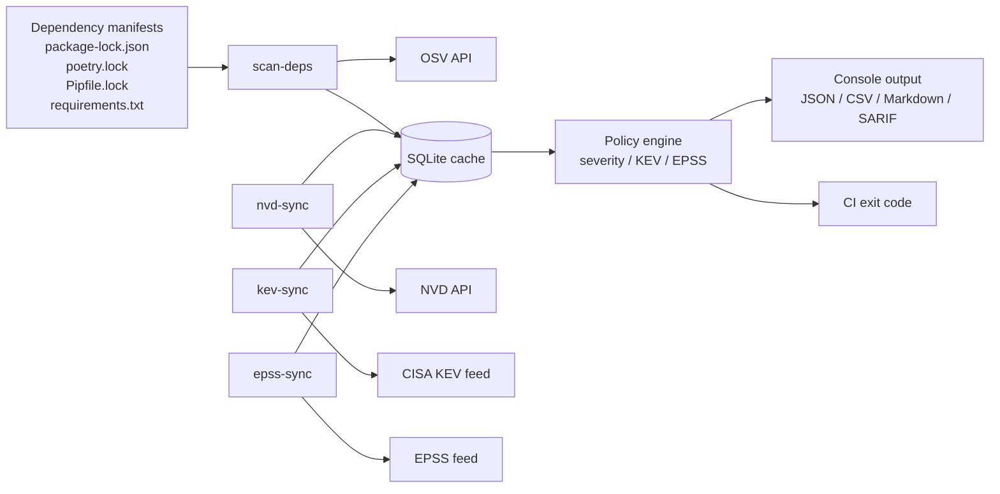

# VulnScanner

[](https://github.com/therayyanawaz/VulnScanner/actions/workflows/ci.yml)
[](https://github.com/therayyanawaz/VulnScanner/actions/workflows/release.yml)
[](https://www.python.org/downloads/)
[](LICENSE)

Open-source vulnerability intelligence pipeline built for developers and security teams that want strong signal without paid feeds.

VulnScanner ingests and normalizes public vulnerability data into a local SQLite store, then applies that intelligence to dependency manifests with practical CI policy controls.

## Table of Contents

- [Why VulnScanner](#why-vulnscanner)
- [Current Feature Set](#current-feature-set)
- [Architecture](#architecture)
- [Data Sources](#data-sources)
- [Quick Start](#quick-start)
- [Command Reference](#command-reference)
- [Policy and Reporting](#policy-and-reporting)
- [Configuration](#configuration)
- [Database Model](#database-model)
- [CI/CD Integration](#cicd-integration)
- [Roadmap](#roadmap)
- [Contributing](#contributing)
- [License](#license)

## Why VulnScanner

- Free and redistributable vulnerability workflow.
- Local-first architecture with SQLite caching.
- Reliable ingestion with retry, rate limiting, and incremental sync.
- Practical risk context: KEV exploitation signal and EPSS probability.
- CI-oriented policy controls with deterministic exit behavior.

> [!NOTE]
> VulnScanner is intentionally modular. Today it ships a hardened data foundation and dependency scanning workflow; container, SBOM, and active scanning are planned next.

## Current Feature Set

### Implemented commands

- `vulnscanner nvd-sync`
- `vulnscanner kev-sync`
- `vulnscanner epss-sync`
- `vulnscanner scan-deps`

### What each command does

- `nvd-sync`: Incremental CVE ingestion from NVD with time-window chunking, retries, and API-key-aware rate limits.
- `kev-sync`: Imports CISA Known Exploited Vulnerabilities and marks matching local CVEs.
- `epss-sync`: Imports EPSS score feed and enriches local CVEs with `epss_score` and `epss_percentile`.
- `scan-deps`: Scans `package-lock.json`, `poetry.lock`, `Pipfile.lock`, or `requirements.txt` through OSV, enriches findings with local CVE/KEV/EPSS context, and enforces CI policy gates.

## Architecture



## Data Sources

| Source | Purpose | URL |
| --- | --- | --- |
| NVD API | Canonical CVE ingestion | `https://services.nvd.nist.gov/rest/json/cves/2.0` |
| CISA KEV | Known exploited CVEs | `https://www.cisa.gov/sites/default/files/feeds/known_exploited_vulnerabilities.json` |
| EPSS CSV | Exploit likelihood scoring | `https://epss.empiricalsecurity.com/epss_scores-current.csv.gz` |
| OSV API | Package vulnerability resolution | `https://api.osv.dev/v1/querybatch` |

## Quick Start

### 1) Install

```bash
git clone https://github.com/therayyanawaz/VulnScanner.git
cd VulnScanner
python -m venv .venv
source .venv/bin/activate  # Windows: .venv\Scripts\activate
pip install -e .
```

### 2) Optional NVD API key

```bash
export NVD_API_KEY="your-nvd-api-key"
```

### 3) Sync vulnerability intelligence

```bash
vulnscanner nvd-sync --since "2024-08-01T00:00:00Z"
vulnscanner kev-sync
vulnscanner epss-sync
```

### 4) Scan dependencies with policy

```bash
vulnscanner scan-deps package-lock.json --policy strict
```

## Command Reference

### `vulnscanner nvd-sync`

Sync CVE data from NVD.

```bash
vulnscanner nvd-sync --since "2024-08-01T00:00:00Z" --until "2024-08-02T00:00:00Z"
vulnscanner nvd-sync --since 7d --until now
```

Options:
- `--since`: ISO8601 timestamp with timezone, or relative value (`7d`, `12h`, `today`, `yesterday`, `now`).
- `--until`: ISO8601 timestamp with timezone, or relative value (`7d`, `12h`, `today`, `yesterday`, `now`).
- `--debug`: raises full traceback for diagnostics.

### `vulnscanner kev-sync`

Sync CISA KEV feed and enrich local CVEs.

```bash
vulnscanner kev-sync
vulnscanner kev-sync --force
```

Options:
- `--force`: bypass TTL and refresh now.

### `vulnscanner epss-sync`

Sync EPSS feed and enrich local CVEs.

```bash
vulnscanner epss-sync
vulnscanner epss-sync --force
```

Options:
- `--force`: bypass TTL and refresh now.

### `vulnscanner scan-deps`

Scan dependencies and apply policy.

```bash
vulnscanner scan-deps package-lock.json
vulnscanner scan-deps requirements.txt --format json --output reports/deps.json
vulnscanner scan-deps Pipfile.lock --format sarif --output reports/deps.sarif
```

Supported manifests:
- `package-lock.json`
- `poetry.lock`
- `Pipfile.lock` (exact lock entries: `==version` or `===version`)
- `requirements.txt` (exact pins: `pkg==version`)

Options:
- `--format [table|json|csv|markdown|sarif]`
- `--output FILE`
- `--min-severity [low|medium|high|critical]`
- `--kev-only`
- `--epss-min 0.0..1.0`
- `--fail-on [low|medium|high|critical]`
- `--fail-on-kev`
- `--fail-on-epss 0.0..1.0`
- `--policy [none|balanced|strict]`
- `--debug`

## Policy and Reporting

### Policy presets

- `none`: no preset behavior.
- `balanced`: default fail gates if not explicitly set:
  - severity `critical`
  - EPSS `>= 0.9`
- `strict`: default fail gates if not explicitly set:
  - severity `high`
  - EPSS `>= 0.7`

### Real-world policy examples

```bash
# Fail on high+ findings
vulnscanner scan-deps package-lock.json --fail-on high

# Only review likely-exploitable set
vulnscanner scan-deps package-lock.json --min-severity high --kev-only --epss-min 0.5

# Hard fail for exploited or high EPSS findings
vulnscanner scan-deps package-lock.json --fail-on-kev --fail-on-epss 0.7

# CI baseline
vulnscanner scan-deps package-lock.json --policy strict
```

### Output formats

- `table`: human-readable terminal summary.
- `json`: structured machine output for automation.
- `csv`: spreadsheet and BI-friendly export.
- `markdown`: audit-ready report for PR comments and docs.
- `sarif`: static-analysis exchange format for GitHub code scanning and security tooling.

## Configuration

Environment variables:

| Variable | Default | Description |
| --- | --- | --- |
| `VULNSCANNER_DB` | `vulnscanner.db` | SQLite database path |
| `NVD_API_KEY` | unset | Enables higher NVD request quota |
| `NVD_MAX_PER_30S` | `5` or `50` with key | NVD request budget per 30s |
| `NVD_MAX_DAYS_PER_REQUEST` | `3` | NVD chunk window in days |
| `OSV_TTL_HOURS` | `12` | OSV cache TTL |
| `OSV_HTTP_TIMEOUT_SECONDS` | `60` | Timeout for OSV HTTP requests |
| `OSV_HTTP_RETRIES` | `3` | Retry attempts for transient OSV API errors |
| `OSV_VULN_DETAIL_CONCURRENCY` | `20` | Max concurrent OSV vulnerability detail lookups |
| `KEV_TTL_HOURS` | `24` | KEV sync TTL |
| `EPSS_TTL_HOURS` | `720` | EPSS sync TTL |
| `VULNSCANNER_UA` | project UA | User-Agent for upstream API calls |

> [!TIP]
> Keep feed sync commands on a schedule (for example daily), then run `scan-deps` per commit/PR.

## Database Model

Core tables:

- `cves`: canonical vulnerability records plus enrichment fields (`is_known_exploited`, `epss_score`, `epss_percentile`).
- `meta`: operational sync state (`nvd_last_mod`, `kev_last_sync`, `epss_last_sync`).
- `osv_cache`: package/version OSV query cache.
- `osv_vuln_cache`: OSV vulnerability detail cache.
- `kev`: raw KEV records.
- `epss`: raw EPSS score records.

SQLite is configured with:

- WAL mode
- foreign keys enabled
- indexes on CVE source and modified timestamp

## CI/CD Integration

Minimal GitHub Actions example:

```yaml
name: Dependency Risk Gate
on: [push, pull_request]

jobs:
  scan:
    runs-on: ubuntu-latest
    steps:
      - uses: actions/checkout@v4
      - uses: actions/setup-python@v5
        with:
          python-version: "3.12"
      - run: pip install -e .
      - name: Refresh intelligence
        env:
          NVD_API_KEY: ${{ secrets.NVD_API_KEY }}
        run: |
          vulnscanner nvd-sync --since "2024-01-01T00:00:00Z"
          vulnscanner kev-sync
          vulnscanner epss-sync
      - name: Enforce policy
        run: vulnscanner scan-deps package-lock.json --policy strict
```

## Roadmap

### Completed

- NVD ingestion with incremental sync and resilience controls.
- KEV sync and CVE exploitation flagging.
- EPSS sync and CVE scoring enrichment.
- Dependency scanning with policy gates and multiple report formats.

### Next

- Container and filesystem scanning integration (`scan-image`).
- SBOM ingestion and analysis (`scan-sbom`).
- Rich HTML reporting and governance workflows.
- Optional self-hosted intelligence integrations.

## Contributing

Contributions are welcome.

```bash
git clone https://github.com/therayyanawaz/VulnScanner.git
cd VulnScanner
python -m venv .venv
source .venv/bin/activate
pip install -e ".[dev]"
pytest -q
```

Suggested contribution areas:

- parser support for additional dependency ecosystems
- scanner adapters (containers, SBOM, IaC)
- report UX and policy rule extensions
- performance and storage optimizations

## License

MIT. See [LICENSE](LICENSE).
