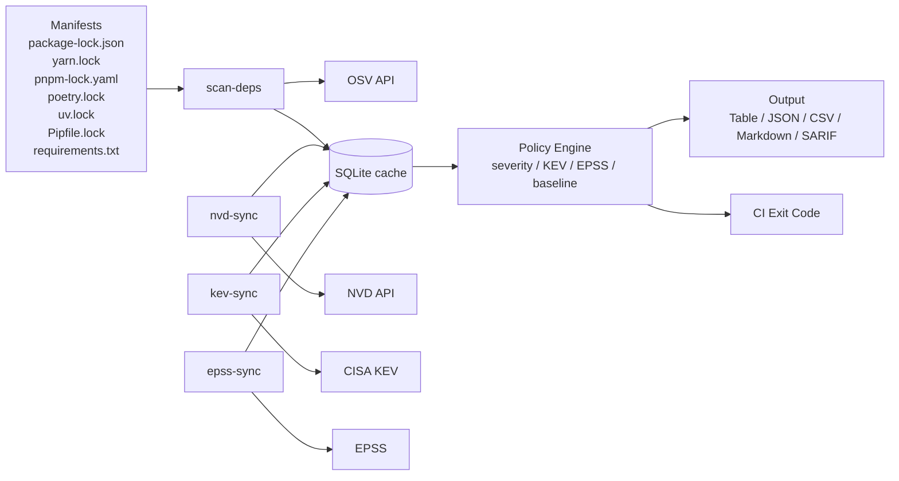

# 🔎 VulnScanner

[](https://github.com/therayyanawaz/VulnScanner/actions/workflows/ci.yml)
[](https://github.com/therayyanawaz/VulnScanner/actions/workflows/release.yml)
[](https://www.python.org/downloads/)
[](LICENSE)
[](#-output-formats)

**Local-first vulnerability intelligence for modern dependency risk workflows.**

VulnScanner ingests public vulnerability intel (NVD, KEV, EPSS), enriches local CVEs in SQLite, and scans lockfiles/manifests with deterministic CI policy gates, offline cache mode, and baseline diffing.

---

## ✨ Why VulnScanner

- 🧠 **Signal-rich**: severity + KEV exploited status + EPSS probability.
- 🏠 **Local-first**: SQLite-backed caching for repeatable scans.
- 🛡️ **CI-ready gates**: fail by severity, KEV, EPSS, strict cache, and new-only diff policy.
- ⚡ **Operationally hardened**: retries, backoff, bounded concurrency, and explicit exit codes.
- 📦 **Ecosystem coverage**: npm + Python lockfile support.

> [!TIP]
> Use `--no-network --strict-cache` for deterministic offline runs in restricted CI environments.

---

## 🧭 Table of Contents

- [🧩 Feature Set](#-feature-set)
- [🏗️ Architecture](#️-architecture)
- [📡 Data Sources](#-data-sources)
- [🚀 Quick Start](#-quick-start)
- [📘 Manual Page](#-manual-page)
- [🛠️ Command Reference](#️-command-reference)
- [📏 Policy & Reporting](#-policy--reporting)
- [🔢 Exit Codes](#-exit-codes)
- [⚙️ Configuration](#️-configuration)
- [🗄️ Database Model](#️-database-model)
- [🧪 CI/CD Example](#-cicd-example)
- [🛣️ Roadmap](#️-roadmap)
- [🤝 Contributing](#-contributing)
- [📄 License](#-license)

---

## 🧩 Feature Set

### ✅ Implemented Commands

- `vulnscanner nvd-sync`
- `vulnscanner kev-sync`
- `vulnscanner epss-sync`
- `vulnscanner scan-deps`
- `vulnscanner state show`
- `vulnscanner state reset`
- `vulnscanner cache stats`
- `vulnscanner cache clear`

### 🧠 What They Do

- `nvd-sync`: Incremental NVD CVE ingestion with rate-limit aware retries.
- `kev-sync`: Imports CISA KEV and marks matched CVEs as known exploited.
- `epss-sync`: Imports EPSS and enriches CVEs with score + percentile.
- `scan-deps`: Scans dependency manifests, enriches findings, renders reports, and enforces policy.
- `state show/reset`: Inspect or reset sync checkpoint metadata.
- `cache stats/clear`: Inspect or clear cache tables with enrichment consistency updates.

### 📦 Supported Dependency Manifests

- `package-lock.json`
- `yarn.lock`
- `pnpm-lock.yaml`
- `poetry.lock`
- `uv.lock`
- `Pipfile.lock` (exact lock pins: `==version` or `===version`)
- `requirements.txt` (exact pins: `pkg==version`; extras/markers/hash suffixes supported)

---

## 🏗️ Architecture



---

## 📡 Data Sources

| Source | Purpose | URL |
| --- | --- | --- |
| NVD API | Canonical CVE ingestion | `https://services.nvd.nist.gov/rest/json/cves/2.0` |
| CISA KEV | Known exploited CVEs | `https://www.cisa.gov/sites/default/files/feeds/known_exploited_vulnerabilities.json` |
| EPSS CSV | Exploit likelihood scores | `https://epss.empiricalsecurity.com/epss_scores-current.csv.gz` |
| OSV API | Package vulnerability mapping | `https://api.osv.dev/v1/querybatch` |

---

## 🚀 Quick Start

### 1) Install

```bash
git clone https://github.com/therayyanawaz/VulnScanner.git
cd VulnScanner
python -m venv .venv
source .venv/bin/activate  # Windows: .venv\Scripts\activate
pip install -e .
```

### 2) (Optional) Set NVD API Key

```bash
export NVD_API_KEY="your-nvd-api-key"
```

### 3) Sync Intel

```bash
vulnscanner nvd-sync --since "2024-08-01T00:00:00Z"
vulnscanner kev-sync
vulnscanner epss-sync
```

### 4) Run Scan + Policy

```bash
vulnscanner scan-deps package-lock.json --policy strict
```

---

## 📘 Manual Page

Quick CLI help:

```bash
vulnscanner -h
vulnscanner scan-deps -h
```

Project man page:

```bash
man ./docs/man/vulnscanner.1
```

---

## 🛠️ Command Reference

### `vulnscanner nvd-sync`

```bash
vulnscanner nvd-sync --since "2024-08-01T00:00:00Z" --until "2024-08-02T00:00:00Z"
vulnscanner nvd-sync --since 7d --until now
```

Options:
- `--since`: ISO8601 with timezone, or relative values (`7d`, `12h`, `today`, `yesterday`, `now`)
- `--until`: ISO8601 with timezone, or relative values (`7d`, `12h`, `today`, `yesterday`, `now`)
- `--debug`

Troubleshooting:
- If you hit NVD `429 Too Many Requests`, retry with a shorter window:
  `vulnscanner nvd-sync --since 90d`
- If sync reports 0 CVEs for a long window, refresh enrichment caches after NVD:
  `vulnscanner kev-sync --force`
  `vulnscanner epss-sync --force`
  `vulnscanner state show`

### `vulnscanner kev-sync`

```bash
vulnscanner kev-sync
vulnscanner kev-sync --force
```

Options:
- `--force`

### `vulnscanner epss-sync`

```bash
vulnscanner epss-sync
vulnscanner epss-sync --force
```

Options:
- `--force`

### `vulnscanner state show`

```bash
vulnscanner state show
vulnscanner state show --format json
```

Options:
- `--format [table|json]`

### `vulnscanner state reset`

```bash
vulnscanner state reset
vulnscanner state reset --key nvd_last_mod
```

Options:
- `--key [nvd_last_mod|kev_last_sync|epss_last_sync]` (repeatable; omit to reset all)

### `vulnscanner cache stats`

```bash
vulnscanner cache stats
vulnscanner cache stats --format json
```

Options:
- `--format [table|json]`

### `vulnscanner cache clear`

```bash
vulnscanner cache clear
vulnscanner cache clear --target kev --target epss
vulnscanner cache clear --all
```

Options:
- `--target [osv|osv-vuln|kev|epss]` (repeatable; default: `osv` + `osv-vuln`)
- `--all`

### `vulnscanner scan-deps`

```bash
vulnscanner scan-deps package-lock.json
vulnscanner scan-deps requirements.txt --format json --output reports/deps.json
vulnscanner scan-deps Pipfile.lock --format sarif --output reports/deps.sarif
vulnscanner scan-deps poetry.lock --no-network --strict-cache
vulnscanner scan-deps package-lock.json --sort-by epss --top 10
vulnscanner scan-deps package-lock.json --baseline reports/prev.json --new-only
vulnscanner scan-deps package-lock.json --baseline reports/prev.json --fail-on high --fail-on-new-only
vulnscanner scan-deps package-lock.json --save-baseline reports/new-baseline.json
```

Options:
- `--format [table|json|csv|markdown|sarif]`
- `--output FILE`
- `--top N`
- `--summary-only`
- `--sort-by [severity|epss|package|id]`
- `--baseline FILE`
- `--save-baseline FILE`
- `--new-only` (requires `--baseline`)
- `--fail-on-new-only` (requires `--baseline`)
- `--min-severity [low|medium|high|critical]`
- `--kev-only`
- `--epss-min 0.0..1.0`
- `--fail-on [low|medium|high|critical]`
- `--fail-on-kev`
- `--fail-on-epss 0.0..1.0`
- `--policy [none|balanced|strict]`
- `--no-network`
- `--strict-cache` (requires `--no-network`)
- `--debug`

---

## 📏 Policy & Reporting

### 🎯 Policy Presets

- `none`: no defaults
- `balanced`: `severity>=critical`, `epss>=0.9` (unless explicitly overridden)
- `strict`: `severity>=high`, `epss>=0.7` (unless explicitly overridden)

### 💡 Practical Workflows

```bash
# Fail on high+
vulnscanner scan-deps package-lock.json --fail-on high

# Prioritize likely exploitable issues
vulnscanner scan-deps package-lock.json --min-severity high --kev-only --epss-min 0.5

# Offline deterministic gate
vulnscanner scan-deps poetry.lock --no-network --strict-cache

# PR diff gate: only new findings
vulnscanner scan-deps package-lock.json --baseline reports/prev.json --new-only

# Keep full output, gate only on new high+
vulnscanner scan-deps package-lock.json --baseline reports/prev.json --fail-on high --fail-on-new-only
```

### 📤 Output Formats

- `table`: terminal-readable summary
- `json`: automation-friendly structured data
- `csv`: spreadsheet / BI export
- `markdown`: PR-ready report output
- `sarif`: GitHub code scanning / security tooling

---

## 🔢 Exit Codes

| Code | Meaning |
| ---: | --- |
| `10` | Policy failure (`--fail-on`, `--fail-on-kev`, `--fail-on-epss`) |
| `11` | Strict cache miss failure (`--no-network --strict-cache`) |
| `12` | Feed sync failure (`nvd-sync`, `kev-sync`, `epss-sync`) |
| `13` | Dependency scan execution failure |

---

## ⚙️ Configuration

| Variable | Default | Description |
| --- | --- | --- |
| `VULNSCANNER_DB` | `vulnscanner.db` | SQLite database path |
| `NVD_API_KEY` | unset | Enables higher NVD request quota |
| `NVD_MAX_PER_30S` | `5` or `50` with key | NVD requests per 30 seconds |
| `NVD_MAX_DAYS_PER_REQUEST` | `3` | NVD chunk window in days |
| `OSV_TTL_HOURS` | `12` | OSV cache TTL |
| `OSV_HTTP_TIMEOUT_SECONDS` | `60` | OSV HTTP timeout |
| `OSV_HTTP_RETRIES` | `3` | OSV transient retry attempts |
| `OSV_VULN_DETAIL_CONCURRENCY` | `20` | OSV detail lookup concurrency |
| `KEV_TTL_HOURS` | `24` | KEV sync TTL |
| `EPSS_TTL_HOURS` | `720` | EPSS sync TTL |
| `VULNSCANNER_UA` | project UA | Upstream User-Agent |

> [!NOTE]
> `nvd-sync` now fails fast for suspicious long-window zero-result runs (to avoid misleading “success” with empty CVE data).

---

## 🗄️ Database Model

Core tables:

- `cves`: canonical CVE records + enrichment (`is_known_exploited`, `epss_score`, `epss_percentile`)
- `meta`: sync state (`nvd_last_mod`, `kev_last_sync`, `epss_last_sync`)
- `osv_cache`: package/version OSV query cache
- `osv_vuln_cache`: OSV vulnerability detail cache
- `kev`: KEV feed records
- `epss`: EPSS feed records

SQLite settings:

- WAL mode
- foreign keys enabled
- indexes on CVE source + modified timestamp

---

## 🧪 CI/CD Example

```yaml
name: Dependency Risk Gate
on: [push, pull_request]

jobs:
  scan:
    runs-on: ubuntu-latest
    steps:
      - uses: actions/checkout@v4
      - uses: actions/setup-python@v5
        with:
          python-version: "3.12"
      - run: pip install -e .
      - name: Refresh intelligence
        env:
          NVD_API_KEY: ${{ secrets.NVD_API_KEY }}
        run: |
          vulnscanner nvd-sync --since "2024-01-01T00:00:00Z"
          vulnscanner kev-sync
          vulnscanner epss-sync
      - name: Enforce policy
        run: vulnscanner scan-deps package-lock.json --policy strict
```

---

## 🛣️ Roadmap

### ✅ Completed

- NVD incremental sync + resilience controls
- KEV sync and exploited CVE enrichment
- EPSS sync and score enrichment
- Policy-driven dependency scanning and multi-format reporting

### ⏭️ Next

- Container/filesystem scanning (`scan-image`)
- SBOM ingestion and analysis (`scan-sbom`)
- Rich HTML governance reporting
- Optional self-hosted intelligence integrations

---

## 🤝 Contributing

```bash
git clone https://github.com/therayyanawaz/VulnScanner.git
cd VulnScanner
python -m venv .venv
source .venv/bin/activate
pip install -e ".[dev]"
pytest -q
```

Great contribution targets:

- parser support for additional ecosystems
- scanner adapters (container, SBOM, IaC)
- policy/report UX enhancements
- storage and performance optimization

---

## 📄 License

MIT. See [LICENSE](LICENSE).
